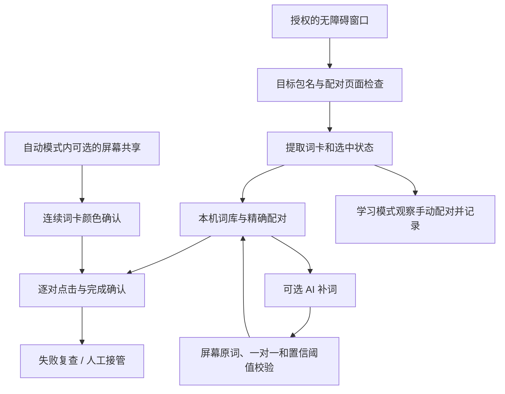

# 架构与数据边界

界面只有学习和自动两个模式，启动统一由 `MainActivity` 协调。Android 11+ 自动模式可授权连续画面加速，拒绝授权也会启动节点配对。节点主链由 `DuolingoNodeService` 协调；页面识别、尾对、选中配对、成功确认和失败恢复尽量拆成可单测的策略。自动点击发出后保持忙状态，确认目标消失、成功计数增加或两张卡变绿后推进；已确认词卡在动画残留期间排除。唯一尾对不需要已知翻译，但仍需完整扫描和稳定确认。

学习记录由手动点击和消失观察形成，词库保存在应用私有目录。学习可能受画面变化影响，用户应能删除误学内容。自动恢复不能以无限点击或反复打开暂停框代替状态判断。

自动模式在平台支持手势且实际控件可操作时使用当前完整扫描中的位置发出 16ms 触点，不重复遍历查找控件；每张卡之间仍读取新页面和选中状态。第一张触点完成回调直接调度搭档检查，控件未知时回退节点操作。

`SlowProgressPause` 只把已确认的配对计为进展，独立于突发队列和画面共享。64ms 看门狗默认在 480ms 无进展时触发；已有未暂停样本时，使用平滑平均耗时的 2.5 倍并限制在 320–800ms。发出点击、重读页面和动画事件不刷新进展时间；新触点仍至少等待 160ms，再复核当前完整题面和成功反馈后请求暂停。

慢速暂停保留活动目标、节点确认基线和补点上限，暂停定时点击、截图回调代次和短期视觉观察。实际看到暂停框后等待 160ms，再复用恢复按钮及消框稳定检查；恢复时重读题面，不把弹框遮住的词当成消失。暂停期间的时间从词对超时和恢复复查期限中扣除。两次恢复无确认进展后保持第三次暂停并提示接管；失败打开暂停框不会形成返回指令循环。学习、手动接管、离开目标应用不启动慢速暂停。

`PartialPairRetry` 在点击后持续观察单张选中与搭档就绪，满足最小等待和稳定窗口后只授权补点未选中的搭档，每个活动词对最多两次。画面中的蓝底选中与白底深字就绪由 `CardVisualState` 区分；实际发出触点前再校验完整页面、两张卡的位置和节点选中状态。连续帧与截图均处理漏点，点击后继续等待成功反馈。

`VisualBoardSelection` 维护完整节点词卡快照，只把几何和文字仍一致的新鲜蓝色观察补充为选中标记；连续画面和截图均需重复观察，节点标记与像素矛盾时保留多个选中以阻止点击。`ActivePairSelectionGuard` 检测活动目标之外的稳定选中，终止旧目标的等待；搭档已知时无需额外 500ms 失败缓冲，仍通过既有选中规划器只点搭档。选中状态不允许全局进度增长确认旧词对完成。正常触点 16ms，有限恢复触点 40ms。

`ConfirmationPollTiming` 在实时帧有效时将节点复查降至 96ms，画面中断后恢复 16ms；当前词对超过 240ms 未确认时允许截图兜底。`VisualConfirmationGeometry` 允许成功绿卡中的文字提前消失，但要求原卡片位置仍有同一几何形状的可见容器，新词占位或位置改变会拒绝该图像。容器只能证明几何位置，不能授权点击。

目标文字和中心位置不变时，`VisualConfirmationGeometry` 允许边框 4px 内的变化；文字缺失仍要求矩形完全一致。`FadedPairConfirmation` 处理漏掉绿色动画后的灰字残留：两张卡开始时均可操作、当前均不可操作、另有可操作词卡、页面完整无遮挡且无选中卡，点击至少 160ms 后的两次灰字观察须相隔至少 96ms、间断不超过 1500ms。空白、仍可点、全页禁用或仅剩灰卡不据此确认，取消词对时清除观察。

`ScreenshotCadence` 在两个截图路径间共享请求预算，默认至少间隔 350ms；系统报告间隔过短时每次增加 250ms，最高 1100ms，避免持续以不兼容的间隔重试。`FastCaptureService` 的共享停止回调立即失效实时帧，并更新活动词对提示；授权未启动、共享中断、等帧或尺寸不符各自显示原因。共享停止后不复用旧授权。

AI 是可选的外部边界：请求只能使用当前候选文字；输出当作不可信数据校验，不能执行模型给出的指令。密钥不随词库或仓库提交，服务端语义正确性无法由本机校验完全保证。

`AiLookupPlan` 先用整屏精确匹配结果标记已知词，再排除已完成或不可点击的卡片生成未知词候选。已知但不可点击属于界面恢复；不阻止其他未知词在后台补全。暂停前重新核对请求签名及本地配对，防止题面变化后等待旧请求。补词失败不直接授权接管，先返回题面，让本地配对与尾对处理优先；`AiFailureRecheck` 仅在同一失败候选仍无本地配对、无遮挡完整题面连续稳定 160ms 后允许暂停提示。页面、位置、屏幕宽度变化或观察中断都会重置复查。

`FastCaptureService` 只为自动模式提供连续颜色样本，直接读取 RGBA 缓冲中的少量像素。更换词对时丢弃首帧，再复核持续绿卡和当前节点后继续；共享停止后保留节点及可用的截图确认。切换学习或关闭辅助时停止服务并释放资源。系统授权可能覆盖更广屏幕，数据边界见 PRIVACY.md。OCR 服务及 ML Kit 已移除。

## 批次提交与独立确认（3.2.23）

`DispatchAcceptance` 仅在点击至少 32ms 后、两次相隔至少 16ms 的完整扫描中确认目标失去可点击状态，并且题面无选中卡、原词与几何有效、原批次下一对可操作，才允许释放当前点击通道。它不记成功；`DeferredPairConfirmation` 保留最多五个待确认词对，禁止重复点击，并分别检查绿卡、灰字及稳定消失。新的替换词不进入旧批次。

待确认词对的节点确认不使用全局计数；发生过批量提交的自动会话也关闭单对的全局计数捷径，防止迟到的增长属于另一对。暂停清除短期视觉观察并保留目标；恢复记录不重放点击。离开题面、旋转、切换模式或手动接管清理记录。

灰卡进入不可操作过滤；同词的灰卡不再给可点击词匹配造成歧义。`SubmittedBoardEvidence` 为全灰尾段提供补充证据：所有可见词必须按文字和位置对应到本次实际提交/已确认的词对，还需全部不可点击且保留卡片容器。配对成功仍要求目标卡重复显示灰字；不存在仅凭整屏不可点击就记成功的路径。

本批队列耗尽且实际发送过点击后使用短暂停，不再以整屏文字总数推断本批是否点完。一次截图可处理多对待确认卡。`ConfirmationPace` 只累计确认事件，按最近三秒墙钟时间计算速率，暂停时间不扣除；前一秒不给瞬时速率。这是软件观察到的完成速度，并非真机性能保证。
